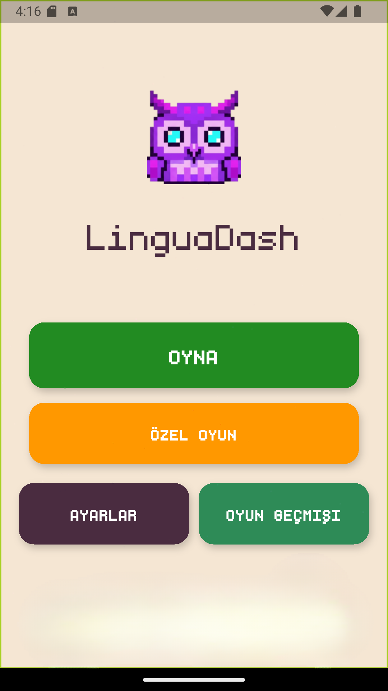
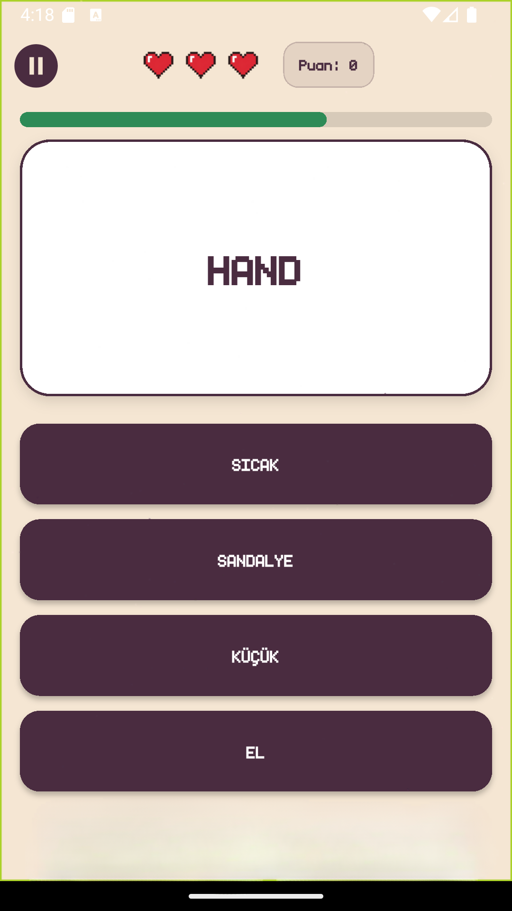
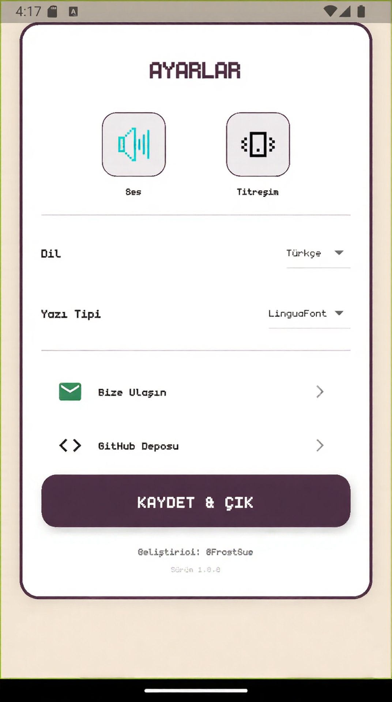
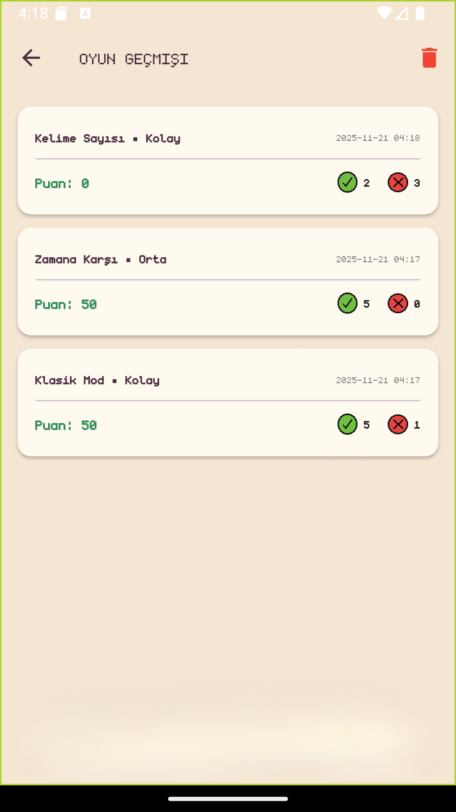

<div align="center">
  
  <h1>LinguaDash</h1>
  <p>
    <b>The Ultimate Cross-Platform Language Learning Game</b>
    <br>
    <b>Nihai Çapraz Platform Dil Öğrenme Oyunu</b>
  </p>

  <p>
    <a href="#english">English</a> •
    <a href="#türkçe">Türkçe</a>
  </p>

  
  
  
</div>

---

<a name="english"></a>
## 🇬🇧 English

### 📖 Project Description

**LinguaDash** is a fast-paced mobile word game designed to improve vocabulary and reflexes. It combines learning with entertainment using a minimalist **Papyrus Theme**, haptic feedback, and dynamic audio effects.

The core objective is to match words with their correct meanings under pressure. What makes LinguaDash unique is its **Custom Mode**, allowing users to create, edit, and play with their own word pools.

### ✨ Key Features

* **🎨 Aesthetic UI:** Warm "Papyrus" theme with smooth Flutter Animate transitions.
* **🎮 Game Modes:**
    * **Infinite Mode:** Survive with 3 lives.
    * **Time Attack:** Race against the clock (30s - 3m).
    * **Word Count:** Sprint through 25-100 words.
    * **Custom Mode:** Play with your own vocabulary list.
* **⚙️ Advanced Mechanics:**
    * **Dynamic Scoring:** +10 for correct, -10 for wrong answers (Animated).
    * **Haptic Feedback:** Vibration feedback on interactions.
    * **Low-Latency Audio:** Optimized sound engine.
    * **Monetization:** Integrated AdMob Banner & Interstitial ads (User-friendly).
* **💾 Local Persistence:** High scores and custom words saved locally.

### 🛠️ Installation & Setup (Important)

1.  **Clone the repo:**
    ```bash
    git clone [https://github.com/FrostSue/LinguaDash.git](https://github.com/FrostSue/LinguaDash.git)
    ```
2.  **Install dependencies:**
    ```bash
    flutter pub get
    ```
3.  **⚠️ AdMob Setup (Required):**
    Since real AdMob IDs are hidden, you must create a secrets file to run the project in Release mode.
    * Create `lib/services/ad_secrets.dart`
    * Add the following code (or use empty strings for dev):
    ```dart
    class AdSecrets {
      static const String androidBanner = '';
      static const String androidInterstitial = '';
      static const String iosBanner = '';
      static const String iosInterstitial = '';
    }
    ```
4.  **Run the app:**
    ```bash
    flutter run
    ```

---

<a name="türkçe"></a>
## 🇹🇷 Türkçe

### 📖 Proje Tanımı

**LinguaDash**, kelime dağarcığını geliştirmek ve refleksleri test etmek için tasarlanmış modern bir mobil kelime oyunudur. Minimalist **Papirüs Teması**, titreşim geri bildirimleri ve dinamik ses efektleri ile öğrenmeyi eğlenceli bir oyuna dönüştürür.

En önemli özelliği **Özel Oyun Modu**dur; kullanıcılar kendi kelime listelerini oluşturabilir ve sadece bu kelimelerle pratik yapabilirler.

### ✨ Özellikler

* **🎨 Estetik Arayüz:** Göz yormayan sıcak tema ve akıcı animasyonlar.
* **🎮 Oyun Modları:**
    * **Sonsuz Mod:** 3 can ile ne kadar ileri gidebileceğinizi görün.
    * **Zamana Karşı:** Süreye karşı yarışın.
    * **Kelime Sayısı:** Belirli sayıda kelimeyi en hızlı sürede bitirin.
    * **Özel Mod:** Kendi kelimelerinizi ekleyin ve oynayın.
* **⚙️ Teknik Detaylar:**
    * **Dinamik Puanlama:** Doğru/Yanlış cevaplarda animasyonlu puan değişimi (+10/-10).
    * **Titreşim:** Hatalarda ve tıklamalarda fiziksel tepki.
    * **Ses Motoru:** Gecikmesiz ses efektleri.
    * **Gelir Modeli:** Kullanıcıyı rahatsız etmeyen AdMob Banner ve Geçiş reklamları.

### 🚀 Kurulum (Önemli)

1.  **Projeyi indirin:**
    ```bash
    git clone [https://github.com/FrostSue/LinguaDash.git](https://github.com/FrostSue/LinguaDash.git)
    ```
2.  **Paketleri yükleyin:**
    ```bash
    flutter pub get
    ```
3.  **⚠️ AdMob Ayarı (Gerekli):**
    Gerçek reklam kimlikleri gizlendiği için projeyi Release modunda derlemek isterseniz `lib/services/` altına `ad_secrets.dart` dosyası oluşturmalı ve içine `AdSecrets` sınıfını (yukarıdaki İngilizce kısımda örneği var) eklemelisiniz. Debug modunda otomatik olarak Test Reklamları çalışır.
4.  **Başlatın:**
    ```bash
    flutter run
    ```

---

## 📸 Screenshots / Ekran Görüntüleri

<p align="center">
  
  
  
  
</p>

---

## 📩 Contact / İletişim

* **Developer:** [@FrostSue](https://github.com/FrostSue)
* **Email:** ellstmc1@gmail.com

<div align="center">
  <sub>Built with ❤️ by FrostSue using Flutter</sub>
</div>